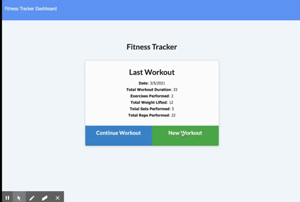

# Fitness Tracker

## Table of Contents 
[Installation Steps](#installation-steps)

[Usage](#usage)

[License](#license)

[Contributing](#contributing)

[Tests](#tests)

[Questions](#questions)

## License
[](https://opensource.org/licenses/MIT)




## Description
The Fitness Tracker allows users keep a track record of their daily workouts and even each of the exercises performed in each workout. The user can select resistance or cardio training. For each type, the user is able to store several related details such as distance or weight. 
A consumer will reach their fitness goals more quickly when they track their workout progress. Therefore, the Fitness Tracker provides graphics that makes tracking workouts fun and simple. 

## Heroku Link
https://mongo-workout-tracker102938.herokuapp.com/?id=6041ee1582f70d00151aeae1

## Installation Steps
1. Fork the repo
2. run nmp install

## Usage
To launch this application input this command, then visit local host 3000.
```bash
npm start
```


## Contributions

This project is not open for contributions at this time.

## Tests
There are no tests in this application.

## Questions
* Email me at carolinarizk@gmail.com
